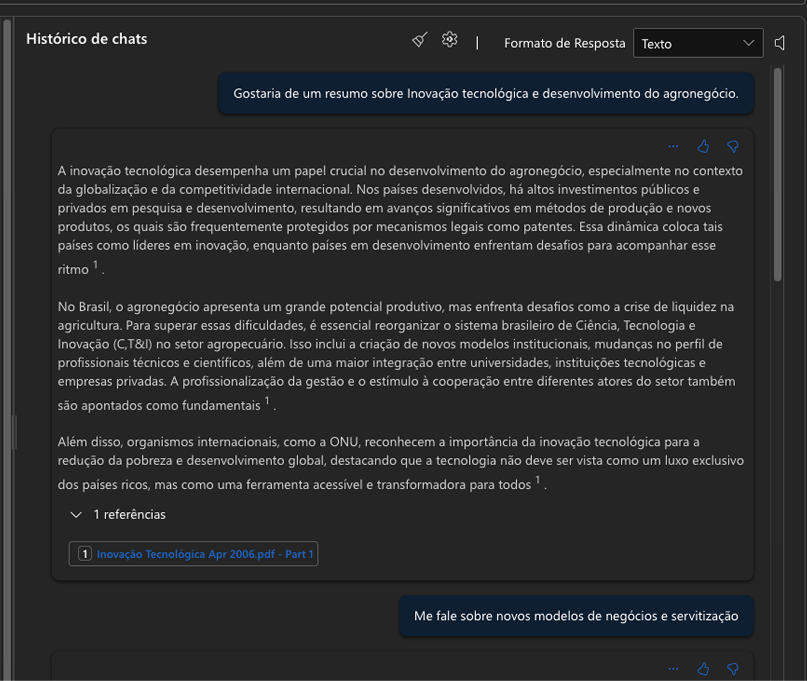
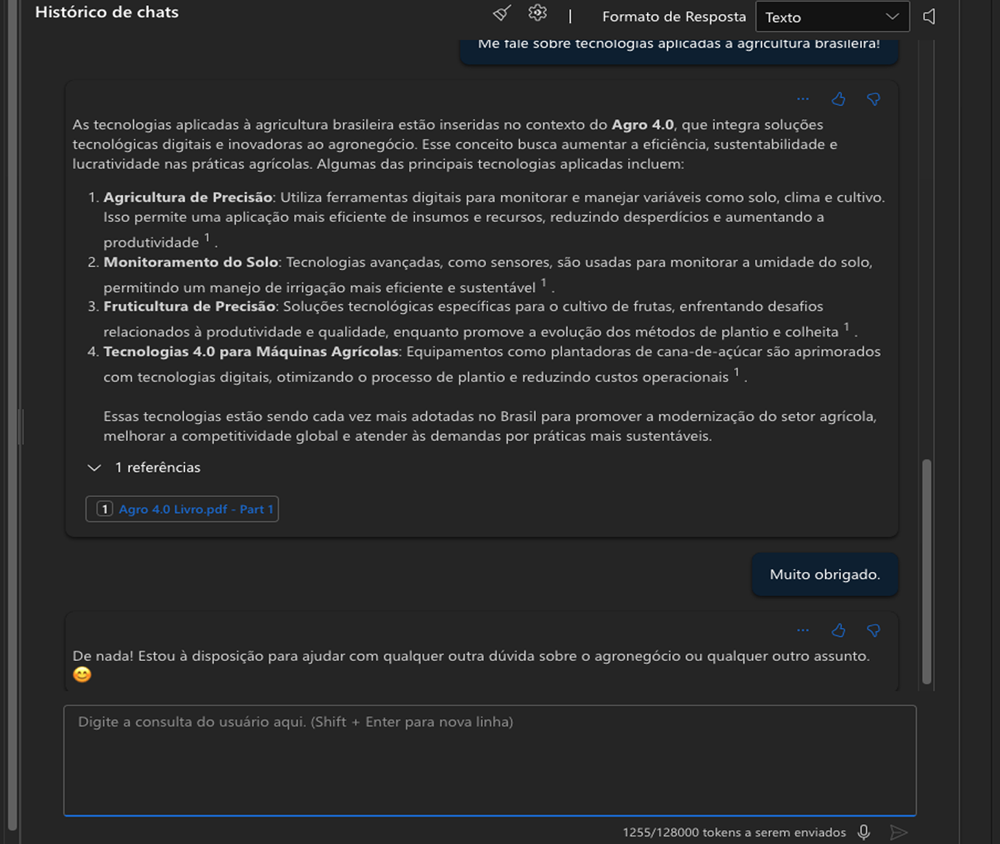
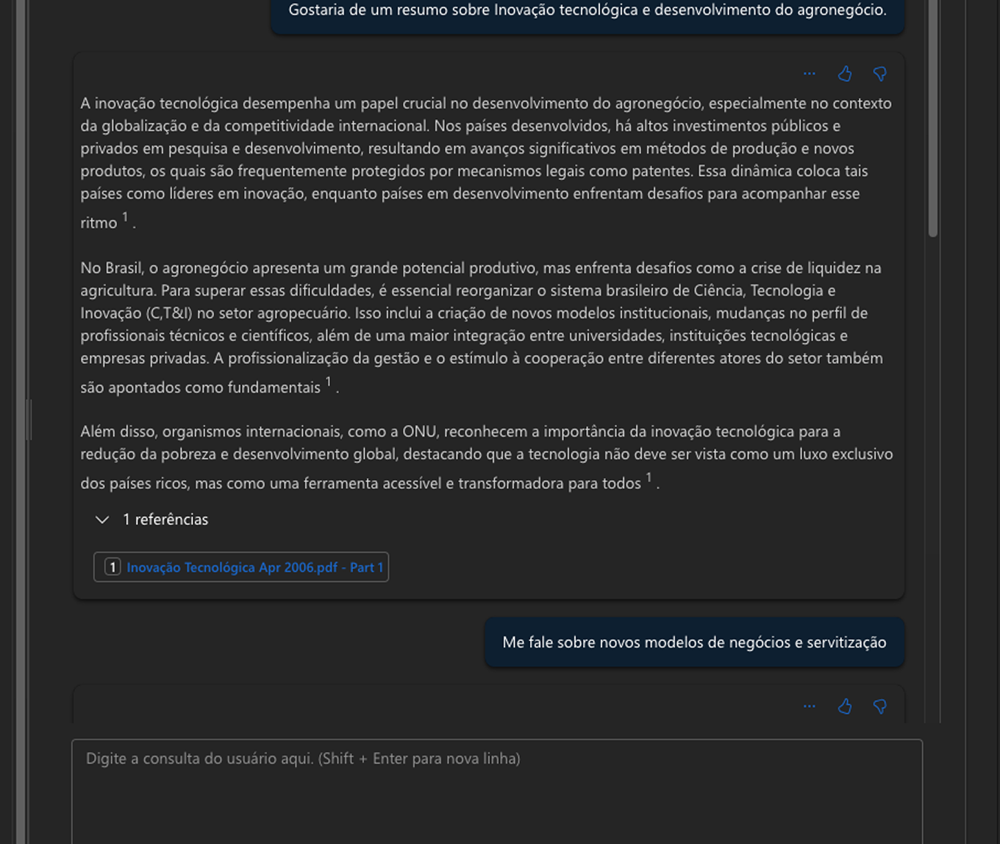

# 🌱 IA Aplicada ao Agronegócio com Azure AI Foundry

Este projeto mostra como utilizar a plataforma **Azure AI Foundry** para aplicar modelos de linguagem em documentos relacionados ao agronegócio, com foco em inovação, sustentabilidade e agricultura de precisão.

## 🧾 Fonte dos Dados

Foram utilizados arquivos PDF enviados diretamente na aba "Fontes de Dados" da plataforma Azure AI Foundry. Esses documentos incluíam relatórios, artigos técnicos e materiais sobre o uso de tecnologia no setor agrícola.

A IA integrada à plataforma foi capaz de analisar os documentos e gerar insights sobre temas como drones no campo, sensoriamento remoto, análise preditiva e automação rural.

## 📝 Sentenças de Exemplo

Para efeito de portfólio e conforme a atividade proposta, o arquivo `inputs/sentences.txt` contém uma amostra de sentenças extraídas/inspiradas nos PDFs analisados. Essas frases podem ser utilizadas para fins de teste, demonstração ou aplicação em modelos de linguagem externa.

## 💡 Principais Aprendizados

- A ingestão de documentos via Azure AI Foundry é simples e poderosa para aplicações de NLP.
- Modelos de linguagem generativa podem extrair insights de forma automática a partir de conteúdo não estruturado.
- O uso da IA no agro permite acelerar tomadas de decisão, identificar padrões e antecipar riscos.

## 📷 Prints do processo

### Consultas feita para a IA com base nos documentos

#### Imagem 01:

#### Imagem 02:

#### Imagem 03:

## 🔗 Possibilidades Futuras

- Classificação automática de temas agrícolas nos documentos.
- Criação de resumos executivos para produtores e gestores.
- Geração de alertas preditivos com base em padrões históricos nos textos.
